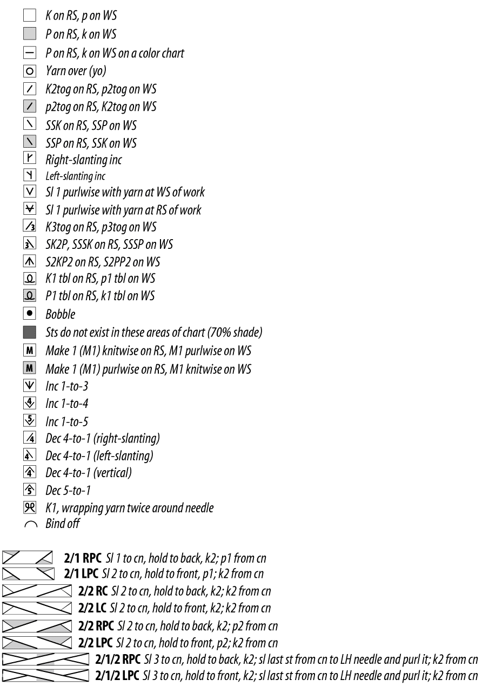
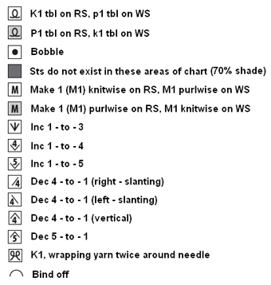
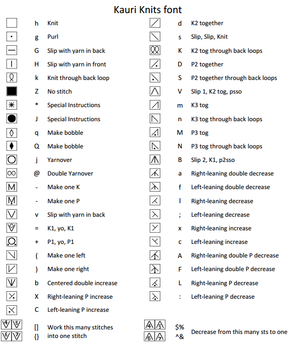

##Knitting Symbols##

###Craft Yarn Council - _craftyarncouncil.com_###
Craft Yarn Council. (2015). Knit Chart Symbols [Website]. Retrived from http://www.craftyarncouncil.com/chart_knit.html (Acessed June 1st, 2016)

----
###Knitting and Crochet Guild - _kcguild.org.uk_###
Knitting and Crochet Guild. (2015). Lace Knitting for Beginners [Website]. Retrived from http://kcguild.org.uk/sharing-knowledge/lace-knitting/lace-knitting-beginners/ (Acessed June 1st, 2016)

----
###knitting in scottsdale design studio - _knittinginscottsdale.net_###
Knitting in scottsdale. (2008). Helpfule info - Knit chart symbols [Website]. Retrived from http://www.knittinginscottsdale.net/helpful_info_16_knit_chart_symbols.html (Acessed June 1st, 2016)

----
###Kauricat's font###
Kauri. (2009). Kauri Knits Font [Website]. Retrived from https://sites.google.com/site/kauriknitsfont/home (Acessed June 1st, 2016)
